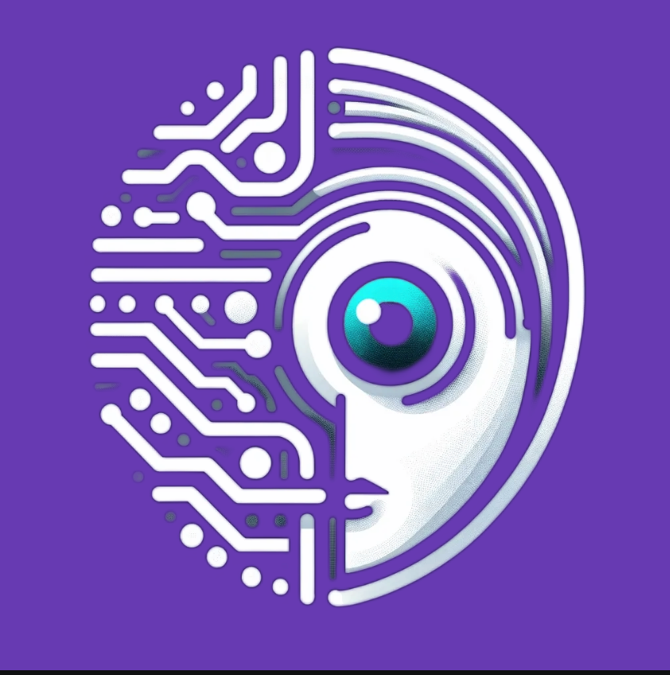

<!-- PROJECT BANNER -->

  

<!-- PROJECT TITLE -->
<h1 align="center">IdentityIQ</h1>

<!-- PROJECT DESCRIPTION -->

A modern and innovative AI-Powered Next.js 14 Web App with People Detection & Recording | using ShadcnUI, leveraging the power of NEXT JS, Typescript, and more.

<!-- TECHNOLOGIES USED -->
## Technologies Used

### Frontend
- **NEXT JS**: Crafting blazing-fast and dynamic web applications.
- **Typescript**: Adding type safety and enhanced developer experience.
- **Tailwind CSS**: Styling the project with minimalistic and elegant designs.
- **Shadcn-UI**: Elevating the UI with stunning components and seamless integration.

### Testing and Quality Assurance
- **Playwright**: Automating browser testing with ease and efficiency.
- **Jest**: Ensuring robustness and reliability with comprehensive testing.
- **Eslint**: Enforcing code consistency and cleanliness for maintainability.
- **Prettier**: Keeping the codebase neat and organized with automatic formatting.
- **Husky**: Streamlining the development process with pre-commit hooks.

<!-- INSTALLATION -->
## Installation

Follow these simple steps to get started with the project:

1. **Clone the repository**: `git clone https://github.com/amanda-natallie/nextjs-shadcn-ai-webcam`
2. **Install dependencies**: `pnpm install`
3. **Start the development server**: `pnpm run dev`
4. **Explore the project**: Visit `localhost:3000` in your browser.

<!-- CONTRIBUTING -->
## Contributing

We welcome contributions from developers of all skill levels. If you'd like to contribute, follow these steps:

1. **Fork** the repository on GitHub.
2. **Clone** the forked repository to your local machine.
3. **Create** a new branch for your feature: `git checkout -b feature-name`
4. **Commit** your changes: `git commit -am 'Add new feature'`
5. **Push** your changes to your fork: `git push origin feature-name`
6. **Submit** a pull request from your fork's branch to our `main` branch.

<!-- LICENSE -->
## License

Distributed under the MIT License. See `LICENSE` for more information.

<!-- ACKNOWLEDGEMENTS -->
## Acknowledgements

Special thanks to the creators and maintainers of the incredible technologies and tools powering this project. Your innovation and dedication make projects like this possible.

<!-- CONTACT -->
## Contact

Have any questions or suggestions? Feel free to reach out to us:

- Email: amanda@vallorisolutions.com
